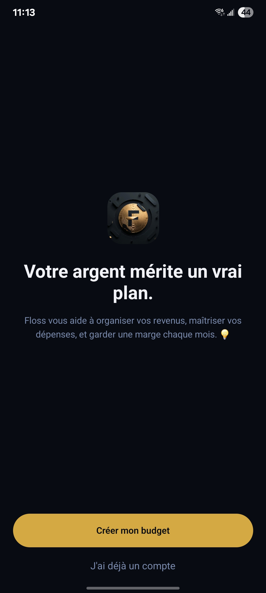
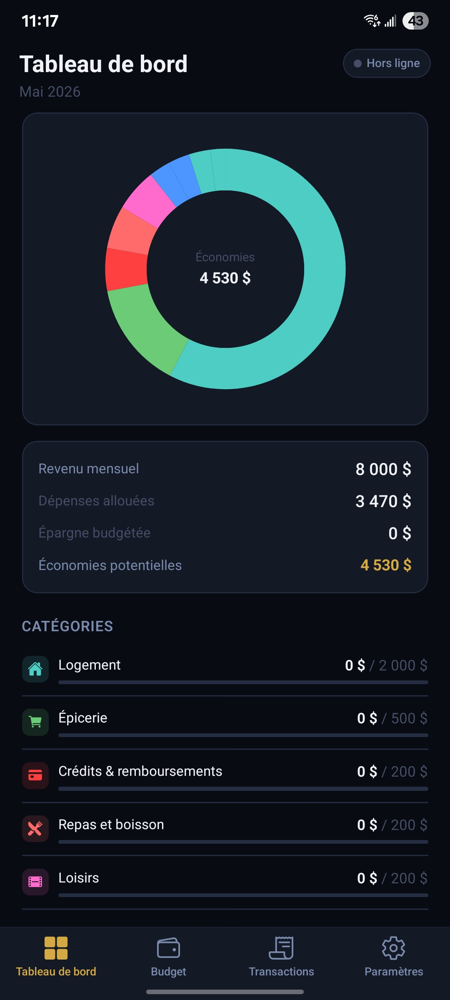
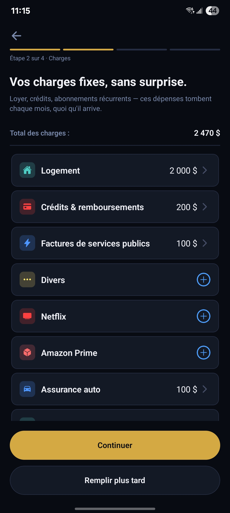
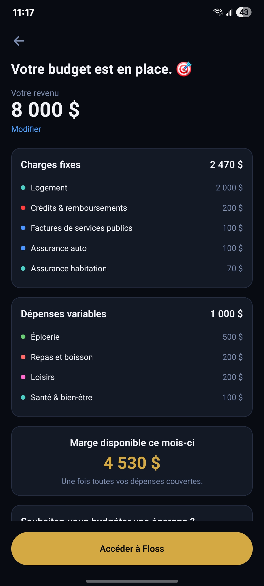

  

<h1 align="center">Floss</h1>

<em>Votre argent mérite un vrai plan.</em>

  
  &nbsp;
  

---

## Install

### Android
**Production app — Google Play Store**
[Download on Google Play](https://play.google.com/store/apps/details?id=com.mystickora.floss)

**Production-like build — Expo (Android & iOS)**
Install the production-like build directly via Expo without going through the stores:
[expo.dev/accounts/mystickora/projects/floss](https://expo.dev/accounts/mystickora/projects/floss)

> Requires the **Expo Go** app or an **Expo dev client** installed on your device.

### iOS
Coming soon on the App Store.
In the meantime, use the Expo preview build link above.

---

## About

Floss is a personal budget app built for people who want clarity on their finances — without connecting a bank account or sharing their data.

- **Onboarding in minutes** — declare your income, fixed charges, and variable spending categories
- **Envelope budgeting** — allocate a budget per category and track spending in real time
- **Offline first** — works fully without an internet connection
- **Optional cloud sync** — create an account to sync across devices
- **No ads, no data selling** — your budget stays yours

---

## Screenshots

  
  
  
  

---

## Privacy

Floss does not collect personal data by default. All budget data stays on your device unless you opt into cloud sync.

[Read the full privacy policy](https://mystickora.github.io/floss-app/privacy-policy.html)

---

Made by <a href="https://github.com/MysticKora">Mystickora</a> · © 2026

